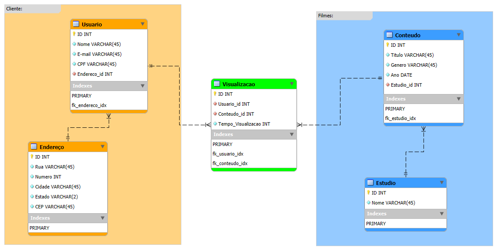

# 📘 UC03 – Auxiliar na Modelagem e Manipulação de Dados

# 📝 Atividade 01 – Diagrama ER para Sistema de Streaming

Nesta atividade, desenvolvi um Diagrama Entidade-Relacionamento (DER) no MySQL Workbench para representar as principais entidades e relações de um sistema de streaming de filmes.

### 🎯 Objetivo
Planejar a estrutura de um banco de dados relacional para suportar operações de uma plataforma de streaming, considerando regras de negócio e integridade dos dados.

### 📄 Entidades Modeladas
- **Usuário** (com vínculo obrigatório a um endereço)
- **Endereço**
- **Conteúdo** (associado a um estúdio)
- **Estúdio**
- **Visualização** (relacionamento N:N entre usuário e conteúdo)

### 📌 Regras aplicadas
- Relacionamento 1:1 entre usuário e endereço  
- Relacionamento 1:N entre estúdio e conteúdo  
- Relacionamento N:N entre usuário e conteúdo (com atributos adicionais)

### 🖼️ Resultado Final

---

## 🖥️ Avaliação do Tutor

(Aguardando resposta)

---

## 📈 Indicadores da Atividade

> Elabora, sob supervisão, modelagem de dados de acordo com projeto de software.
