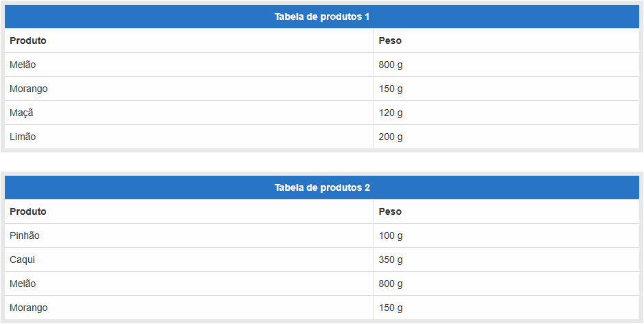
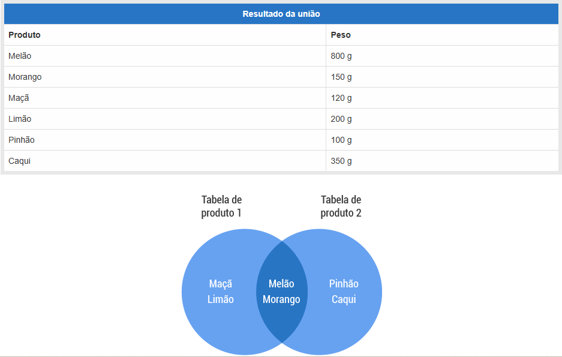
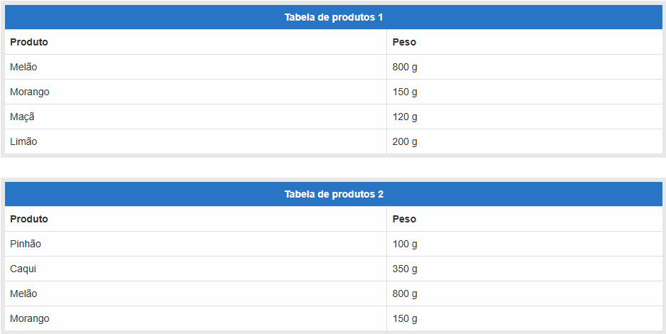
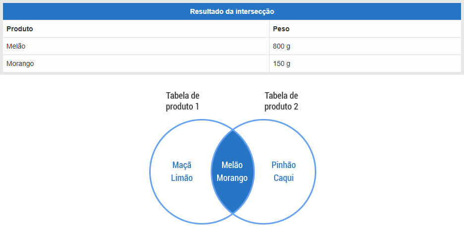
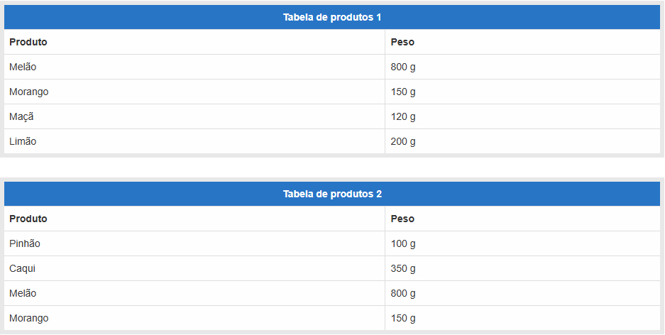
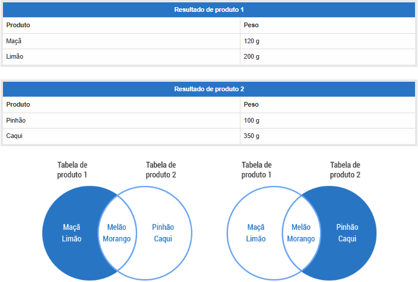

# Diário de Estudos — UC03

## 📅 15 de maio de 2025

### Tópico: Modelagem Conceitual do Banco de Dados

**Início do estudo em:**
- Modelagem Conceitual do Banco de Dados

**Conteúdo a ser aprendido:**
- Levantamento de dados  
- Levantamento e especificação de requisitos
- Dicionário de dados
- Arquitetura de arquivos de dados
- Integridade referencial

---

### 📘 Lição 1: Levantamento de dados

- O levantamento de dados é a etapa em que se coleta todas as informações relevantes sobre o ambiente que será modelado.
- Envolve observar processos, conversar com usuários e levantar documentos.
- É uma etapa investigativa e aberta, sem ainda criar diagramas ou restrições técnicas.

---

**🧠 Aprendizado:**

O **levantamento de dados** tem como objetivo entender as principais e reais necessidades do cliente.  
Para isso, são utilizadas diversas técnicas, como:

**🔍 Observação ativa ou pessoal:**
> Consiste em observar diretamente as atividades do usuário em seu ambiente de trabalho, fazendo anotações.  
> O objetivo é compreender o que está envolvido nas tarefas, como elas são realizadas e com qual finalidade.

**📋 Questionário**  
> Método de coleta de informações por meio de perguntas.  
> Pode ser:
> - **Fechado**: com alternativas de múltipla escolha.  
> - **Aberto**: permitindo respostas livres.  
> É basicamente como uma prova.

**🗣️ Entrevista**  
> Semelhante ao questionário, porém realizada oralmente.  
> Isso permite adaptar as perguntas conforme a conversa evolui, tornando a coleta mais rica e dinâmica.

**📄 Análise da documentação**  
> Consiste em analisar documentos já existentes na empresa relacionados ao projeto, como planilhas, formulários e registros.

> Exemplo: uma empresa que ainda utiliza papel e caneta para cadastrar clientes (sim, isso ainda existe!). Agora, com o aumento da demanda, precisa informatizar esse processo.  
> O analista irá examinar os formulários impressos que a empresa já utiliza para entender como esse cadastro é feito atualmente.

> Como exatamente ele vai fazer isso? Problema dele! 😄  
> (Brincadeiras à parte... um dia pode ser o seu trabalho ou o meu, então é bom entender desde já!)
#

## 📅 19 de maio de 2025

### 📘 Lição 2: Levantamento e especificação de requisitos

- Essa etapa define o que o sistema precisa fazer.
- Consiste em documentar de forma clara e organizada como o sistema pode alcançar esses objetivos.
- Os requisitos levantados são compartilhados com a equipe e os clientes para garantir o alinhamento entre todos os envolvidos.

---

**🧠 Aprendizado:**

Sabe quando alguém te pede um favor, mas não explica direito o que quer? Quais são as chances disso dar errado? 
Para evitar que isso aconteça no seu projeto, é realizado o **levantamento e especificação de requisitos** que consiste basicamente em *entender — o que o sistema — precisa fazer*

É para isso que utilizamos as **técnicas de levantamento de dados** que estudamos no dia 17/05, como observação, entrevista e questionário.

Depois de coletado as informações, é hora de **especificar os requisitos**. Ou seja, colocar tudo no papel de forma clara e organizada sobre o que será feito, e **compartilhar com os membros da equipe** para garantir que todos (isso inclui o cliente, tá?) compreendam e concordem com o que será desenvolvido.

Isso ajuda todo mundo a falar a mesma língua, evitar confusão e tudo acabar no casos de familía.

  

---

### 📘 Lição 3: Dicionário de dados

- Descrever o que cada dado significa.
- Garantir que todo mundo entenda os dados da mesma forma.

---

**🧠 Aprendizado:**

Pense em um diacioário de verdade, como o Aurélio. Ele explica o que cada palavra significa, certo?  
O **dicionário de dados** é parecido: ele explica os *componentes do sistema* — o que são, como são usados e qual seu significado.

É nele que a gente organiza e descreve cada informação que o sistema vai usar.

**📌 Importância:**

A qualidade da informação depende de como os dados são coletados, organizados e contextualizados. Um dicionário de dados bem elaborado garante que *os dados serão compreendidos corretamente por todos os envolvidos no projeto*.

**⚠️ Quando não há dicionarização:**

Sem um dicionário de dados, se as informações forem entregues apenas em uma planilha ou relatório, podem surgir **interpretações equivocadas**. Isso porque não ficará claro o que cada coluna ou campo representa. A falta de contexto abre espaço para confusão.

**Exemplo de Dicionário de dados:**
Imagine uma entidade “consumidor”, com seus atributos. Em um dicionário de dados ficaria assim:

  

#

## 📅 20 de maio de 2025

### Lição 4: Arquitetura de Arquivos de Dados

- Conhecer os mecanismos de armazenamento do MySQL (MyISAM e InnoDB)

---

**🧠 Aprendizado:**

A **arquitetura de arquivos de dados** define como os dados são armazenados e acessados dentro de um sistema. No contexto de bancos de dados relacionais, como o MySQL, isso envolve a **escolha do mecanismo de armazenamento** das tabelas. Para simplificar, é como escolher se você irá usar um HD ou um SSD para salvar seus arquivos.

Mas falando sobre MySQL, os dois principais mecanismos são:

- **MyISAM**
- **InnoDB**

Essa escolha entre um ou outro afeta diretamente o **desempenho** e a forma como o banco lida com **concorrência**, ou seja, quando vários usuários acessam ou modificam os dados ao mesmo tempo.

Para isso, precisamos entender o que é bloqueio.

---

🔒 **O que é bloqueio no MySQL?**  
O bloqueio é um mecanismo de proteção dos dados no banco de dados. Ele evita que dois usuários modifiquem os mesmos dados ao mesmo tempo, o que poderia gerar erros ou informações inconsistentes.

Por exemplo:  
Imagine que duas pessoas tentam editar o mesmo parágrafo de um documento ao mesmo tempo. Se não houver um controle (bloqueio), uma pode apagar o que a outra escreveu. O bloqueio serve para impedir isso, garantindo que uma pessoa de cada vez possa modificar os dados.

Entendido o bloqueio, vamos ver as principais diferenças entre MyISAM e InnoDB:

**MyISAM**
- Mais rápido para leitura de dados (ex: consultas em grandes tabelas que quase não mudam).
- Faz bloqueio da tabela **inteira** ao modificar dados (mais simples, mas menos eficiente em situações com muitas gravações).
- Bom para sistemas onde os dados são lidos com frequência, mas raramente alterados.

**InnoDB**
- Melhor para escrita e atualização de dados frequentes.
- Usa bloqueio por **linha**, permitindo múltiplas alterações simultâneas em diferentes partes da tabela.
- Ideal para aplicações dinâmicas, como sistemas com muitos usuários atualizando dados ao mesmo tempo.

💪🏼 **Na prática**  
**Bloqueio de Tabela (MyISAM):**  
Você quer atualizar 1 linha, mas o MySQL bloqueia a tabela inteira.  
Outros usuários que tentarem ler ou escrever nessa tabela vão ter que esperar.

**Bloqueio de Linha (InnoDB):**  
Você atualiza apenas 1 linha, e o MySQL trava só essa linha.  
Outros usuários podem continuar mexendo nas outras linhas normalmente.

❓ **Por que isso importa?**  
MyISAM (bloqueio de tabela) é mais simples, mas pode causar atrasos em sistemas com muitos acessos simultâneos.  
InnoDB (bloqueio de linha) é mais complexo, mas permite maior concorrência e desempenho em sistemas que fazem muitas alterações nos dados.

Logo, chegamos à conclusão de que a escolha entre qual mecanismo de armazenamento usar depende do tipo de aplicação e da frequência de leitura/gravação dos dados.

Imagine um site com uma tabela chamada `noticias`:

- Se os usuários **só leem** as notícias, e elas **quase nunca mudam**, o **MyISAM** pode funcionar bem.
- Se os usuários **comentam**, **curtem** e as notícias são **editadas frequentemente**, o **InnoDB** é muito melhor — graças ao **bloqueio por linha**, que permite múltiplas modificações ao mesmo tempo sem travar tudo.

#

## 📅 21 de maio de 2025

### 📘 Lição 5: Teoria dos Conjuntos

- Conceitos básicos da teoria dos conjuntos
- Operações com conjuntos: união, interseção e diferença

**🧠 Aprendizado:**

Primeiro, quero dizer para não se assustar — você vai ver algumas fórmulas matemáticas aqui, mas a ideia é entender como a teoria dos conjuntos está relacionada a banco de dados, e é bem simples. É sobre como você vai extrair os dados do banco de forma organizada.

**A teoria dos conjuntos** é um ramo da matemática que estuda os *conjuntos* e o comportamento dos *elementos*.

Mas o que são elementos e conjuntos?

**Elementos** podem ser qualquer coisa: números, pessoas, frutas...

Por exemplo: digamos que você tenha uma fazenda, e nela há vários animais. Logo, podemos dizer que você tem uma coleção de animais. Aqui, os seus animais são os elementos.

**Conjuntos**  
Você pode dividir seus animais em grupos, não pode? Ex.: um grupo de animais com asas — galinha, pato, piriquito, peru — e outro grupo com animais quadrúpedes, como porco, cavalo, boi etc.  
Esses grupos são chamados de quê?  
Exatamente: **conjuntos**.

Às vezes, um elemento pode fazer parte de dois conjuntos ao mesmo tempo.  
Se você tivesse um grifo, ele faria parte tanto do conjunto “animais com asas” quanto do conjunto “animais quadrúpedes”.
- Além disso seria muito bacana.

A teoria dos conjuntos estuda essas relações.

A relação mais básica entre um elemento e um conjunto é dizer se o elemento pertence ou não a ele.  
O elemento *galinha* pertence ou não ao conjunto *animais com asas*?

Na matemática, isso é representado assim:  
**x ∈ A** (x pertence ao conjunto A)  
**x ∉ A** (x não pertence ao conjunto A)

Agora vamos ver algumas **operações com conjuntos** e como elas se aplicam ao banco de dados.

---

**União:**
> Como o póprio nome já diz, essa operação irá *unir* os elementos dos conjuntos:

> Ao aplicar a união, o resultado seria:

**Intersessão:**
> Essa operação irá selecionar somente os elementos **iguais** presentes nas duas tabelas. Veja só:

> Resultado:

**Diferença:**
> Dessa vez, a operação irá selecionar os elementos que são **diferentes** nas tabelas:

> Resultado:

---

## 📘 Lição 6: Tipos de Dados

- 
- 

**🧠 Aprendizado:**

---

## Nota pessoal:
Ufá!!! Esse módulo foi difícil, heim. Teve muitos termos dos quais não estou acostumado e tive que pesquisar bastante para compreender cada um dos conceitos apresentados e espero ter entendido tudo direitinho para compartilharcom você.

Se você tambem está se sentindo assim, não se preocupe, tenho a esperança de que tudo irá ficar mais claro conforme formos aplicando esses conceitos **na prática** assim espero (desespero).

> Imagine que você faça amizade com um ET. O que seria mais fácil, explicar o que é uma vaca ou *mostrar* a ele um animal chamado vaca?

Tudo fica mais simples depois que se mostra como é feito e acredito que a idéia até aque seja apenas ter um conhecimento teórico para nos preparar para o que ainda iremos ver e aplicar pela frente.

Até o proximo módulo.

(ainda em desespero...)