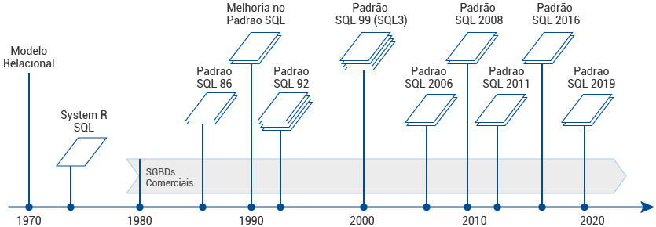
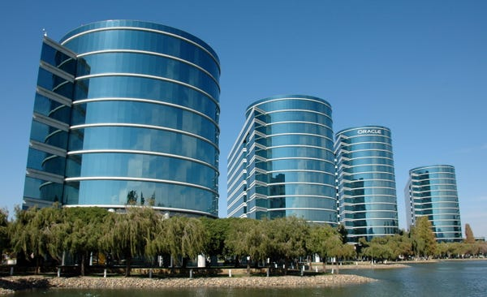
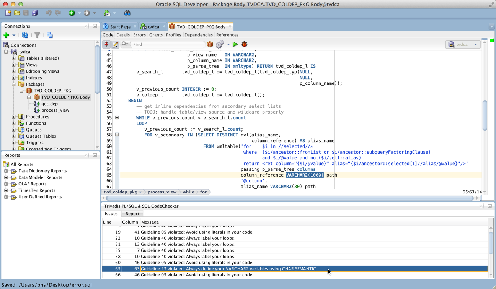
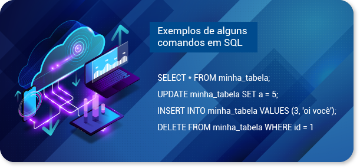
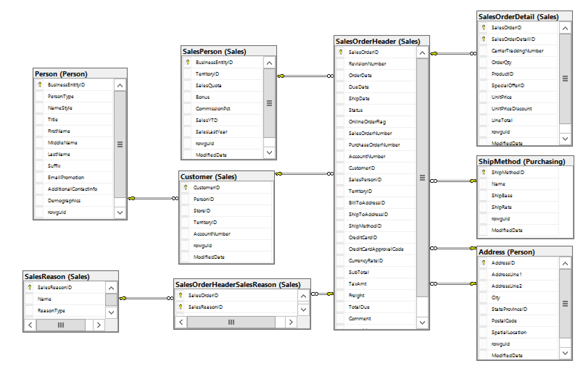

# Diário de Estudos — UC03

## 📅 27 de maio de 2025

### Tópico: Linguagem SQL

## ℹ️ Informações

- **Início do estudo:** 27 de maio de 2025
- **Data de conclusão:** 27 de maio de 2025
- **Última atualização:** 27 de maio de 2025

## 📚 Conteúdo do Módulo

- [📜 Histórico e definição](#-lição-1-histórico-e-definição)
- [🛠️ Aplicabilidade](#-lição-2-aplicabilidade)

---

> ℹ️ **Nota:**  
> Esta lição aborda o histórico da linguagem SQL. Como é um conteúdo mais factual e direto, optei por apenas registrar as informações pesquisadas, sem reformulações pessoais ou comentários adicionais.  
> Por isso, substituí a seção habitual "🧠 Aprendizado" por "📄 Conteúdo", que neste caso será composto por trechos copiados e colados diretamente das fontes de estudo.

## 📘 Lição 1: Histórico e definição

- Origens da linguagem SQL
- Primeiros SGBDs comerciais
- Influência da IBM e da Oracle

**📄 Conteúdo:**

A linguagem SQL (structured query language, ou “linguagem de consulta estruturada”, em português) passou por várias padronizações e atualizações ao longo dos anos, sendo as mais notáveis a SQL-92 e a SQL-99, que definiram boa parte dos recursos vigentes até hoje.

A linguagem SQL foi originalmente desenvolvida pela empresa IBM. O doutor Edgar F. Codd (1923-2003), pesquisador e cientista, concebeu o primeiro modelo de base de dados relacional, isso ainda no ano de 1969. Ele buscava novas maneiras de trabalhar com grandes quantidades de dados e, no final da década de 1960, começou a pensar em uma maneira de aplicar os princípios matemáticos para resolver os inúmeros problemas que ele estava encontrando.

Depois de já ter apresentado ao mundo o modelo de bancos de dados relacionais, empresas e organizações, como universidades e laboratórios de pesquisa, começaram a unir esforços para desenvolver uma linguagem que pudesse ser usada como raiz para sistemas de bancos de dados relacionais. Assim, no início da década de 1970, várias linguagens surgiram para esse propósito, e foi nos laboratórios de pesquisa de Santa Teresa, distrito de San Jose, na Califórnia, que esse esforço foi destacado.

Observe os marcos a seguir:

**Exemplos históricos abordados:**

- **System/R**  
  A IBM começou, ainda no início da década de 1970, um projeto de pesquisa chamado System/R, com a intenção de provar que era viável melhorar o design e a implementação de modelos relacionais de bancos de dados. Entre 1974 e 1975, provou com sucesso a criação e manutenção de um protótipo de um banco de dados relacional.

- **SQL (Structured Query Language)**  
   Ao mesmo tempo que a IBM trabalhava em criar essa facilidade em design e manutenção de bancos de dados relacionais, os pesquisadores estavam também empreendendo mais um esforço para definir uma linguagem voltada a esses bancos de dados, tanto para a manutenção quanto para a criação deles. Em 1974, o doutor Donald Chamberlin e seus colegas desenvolveram a structured english query language (Sequel), linguagem esta que permitia que os seus usuários utilizassem uma linguagem de alto nível (em inglês) para controlar e configurar os seus bancos de dados.

    Com o tempo, o doutor Chamberlin e seus colegas, por motivos legais, mudaram o nome da linguagem de Sequel para SQL (structured query language), mas, até hoje, muitos ainda pronunciam o SQL como Sequel.

    

    

- **Oracle**  
   Embora o System/R e o SQL da IBM provassem que os bancos de dados relacionais eram viáveis, a tecnologia de hardware na época não era suficientemente poderosa para tornar o produto atraente para as empresas.

    Então, em 1977, um grupo de engenheiros, em Menlo Park, na Califórnia, formou a Relational Software, Inc., com o objetivo de construir um novo produto de banco de dados relacional baseado em SQL, que chamaram de Oracle. A Relational Software distribuiu seu produto em 1979, fornecendo o primeiro RDBMS (relational database management system) disponível comercialmente. Uma das vantagens do Oracle era que ele rodava nos minicomputadores digitais VAX, em vez dos mainframes IBM, que eram muito mais caros.

    Desde então, a empresa Relational Software foi renomeada como Oracle Corporation e é até hoje uma das principais fornecedoras de software RDBMS.

    

    

- **Ingres**  
   Ao mesmo tempo que todos estes padrões eram adotados, Michael Stonebraker, Eugene Wong e vários outros professores da Universidade de Berkeley, na Califórnia, trabalhavam desenvolvendo uma linguagem de prototipagem de banco de dados relacionais que acabaram por chamar de Ingres. Essa linguagem era bem mais estruturada que o SQL, embora utilizasse muito menos comandos em inglês. Neste momento, já era visível que o SQL se tornaria a linguagem de controle e prototipagem de bancos de dados, fazendo com que posteriormente a linguagem Ingres fosse convertida em uma linguagem baseada no SQL. Em 1980, muitos professores saíram da universidade, formaram a Relational Technology, Inc. e, em 1981, anunciaram, após várias melhorias e transformações, a primeira versão comercial da linguagem Ingres. Atualmente parte da empresa Action, a Ingres ainda é uma das linguagens mais utilizadas em inúmeros produtos até hoje.

   

---

## 📘 Lição 2: Aplicabilidade

- Onde e por que o SQL é usado
- Casos reais e modernos de uso

**📄 Conteúdo:**

A principal funcionalidade – e, por consequência, a “força” – do SQL é que ela é uma linguagem que
beneficia todos os tipos de usuários e programadores, incluindo administradores de bancos de dados,
gerentes de projetos e até o usuário final.

O objetivo da SQL é fornecer a interface para um banco de dados relacional, como, por exemplo, um
banco de dados Oracle. Todas as instruções SQL são instruções para o banco de dados e é nesse ponto
que a SQL se difere de linguagens de programação de propósito geral como C e Java.

- **Recursos** 
    Entre os recursos da SQL, destacam-se os seguintes:

        - Processa conjuntos de dados como grupos em vez de unidades individuais.
        - Fornece navegação automática para os dados.
        - Usa declarações que são complexas e poderosas individualmente e, portanto, são independentes.
        - É capaz de fazer controle de fluxo (as instruções de controle de fluxo não faziam parte da SQL originalmente, mas são encontradas na parte opcional recentemente aceita de SQL).

- **Tarefa**
    A SQL permite que você trabalhe com dados no nível lógico. Você precisa se preocupar com os detalhes de implementação apenas quando quiser manipular os dados. Por exemplo, para recuperar um conjunto de linhas de uma tabela, você define uma condição usada para filtrar as linhas. Todas as linhas que satisfazem a condição são mostradas em uma única etapa e podem ser passadas para o usuário, para outra instrução SQL ou para um aplicativo. Você não precisa lidar com as linhas uma por uma, nem se preocupar com a forma como elas são armazenadas ou recuperadas fisicamente.

    A SQL fornece instruções para uma variedade de tarefas, que inclui:

        - Consultar dados em um banco de dados
        - Inserir, atualizar e excluir linhas em uma tabela
        - Criar, substituir, alterar e eliminar objetos
        - Controlar o acesso ao banco de dados e a seus objetos
        - Garantir a consistência e integridade do banco de dados

    A SQL unifica todas estas tarefas em uma linguagem consistente e de fácil entendimento por conter instruções em alto nível (linguagem comum).

    Melhorias recentes na SQL a tornaram uma linguagem ainda mais poderosa. Atualmente, por meio da SQL, o programador ou gerente do banco de dados é capaz de armazenar, pesquisar e processar dados muito mais complexos do que os idealizadores dessa linguagem jamais imaginaram.

    

    Os bancos de dados ainda são muito utilizados hoje em dia devido à sua segurança e robustez. Apesar de a SQL ter um padrão estrutural, entre os diversos SGBD (software de gerenciamento de banco de dados) existentes (Oracle, PostgreSQL, SQLite, Microsoft SQL Server, MySQL etc.), pequenas variações nos comandos podem ocorrer. Ou seja, no momento em que a organização ou a equipe optam por um banco de dados ou outro, o desenvolvedor precisará atentar-se às especificidades da linguagem SQL para o SGDB escolhido para o desenvolvimento.

    Por ser uma linguagem de fácil entendimento, nem só desenvolvedores se beneficiam dela. Muitos analistas e cientistas de dados acabam por estudá-la para que possam fazer suas próprias consultas e análises em um banco de dados específico.

    

    Assim como quase toda linguagem de programação, a SQL é constituída por uma sequência de comandos, e o comando, por sua vez, consiste em uma sequência de termos chamados de tokens e termina sempre com um ponto e vírgula (“;”).

    Um termo, ou token, pode ser uma palavra-chave da linguagem, um identificador entre aspas ou até um caractere especial, e são geralmente separados por um espaço em branco.

    

    Essa é uma sequência de quatro comandos, um em cada linha. Atente-se ao fato de que a cada ponto e vírgula, o comando termina e, na próxima linha, outro comando inicia.

    Geralmente, a primeira palavra é o comando que se deseja executar. No exemplo citado estão:

        - Na primeira linha, o comando select, usado para buscar (ou selecionar) informações armazenadas no banco de dados
        - Na segunda linha, o comando update, usado para atualizar uma informação armazenada no banco de dados
        - Na terceira linha, o comando insert, usado para adicionar (inserir) dados em uma tabela de banco de dados
        - Na terceira linha, o comando delete, usado para excluir dados de uma tabela
    
    Esses são os quatro comandos fundamentais da SQL e implementados por qualquer SGBD. Além desses, há muitos outros comandos que permitem que se faça consultas, alterações, pesquisas e criação de variados tipos de dados e tabelas.

    São muitos os benefícios de se aprender a linguagem SQL, pois bancos de dados relacionais estão por toda parte, e qualquer pessoa que tenha acesso a esses bancos e saiba SQL é capaz de fazer buscas em quantidades muito grandes de dados.

    Um exemplo disso é que, atualmente, com o advento da computação em nuvem, uma variedade muito grande de dados está disponível ao acesso público na Internet e, com conhecimento e dedicação, todos esses dados podem ser facilmente manipulados e ou armazenados, ou até mesmo manipulados com pequenos trechos de código.

    A linguagem SQL é fácil de aprender, pois utiliza palavras simples em inglês para gerar seus comandos a serem executados no banco de dados, assim, qualquer pessoa que entenda o mínimo de lógica consegue entender e manipular dados facilmente.

    

    Dada a quantidade de dados que hoje em dia são manipulados na Internet, dominar a SQL permite que o usuário ou programador consiga rapidamente manipular e pesquisar milhões, bilhões e até trilhões de valores em questão de segundos.

    Em resumo, de uma pequena empresa que manipula apenas centenas de dados diariamente, até uma rede social que manipula centenas de milhões de dados por segundo, todas se beneficiam da robustez e agilidade que a linguagem SQL e seus bancos de dados trazem para o mundo.
