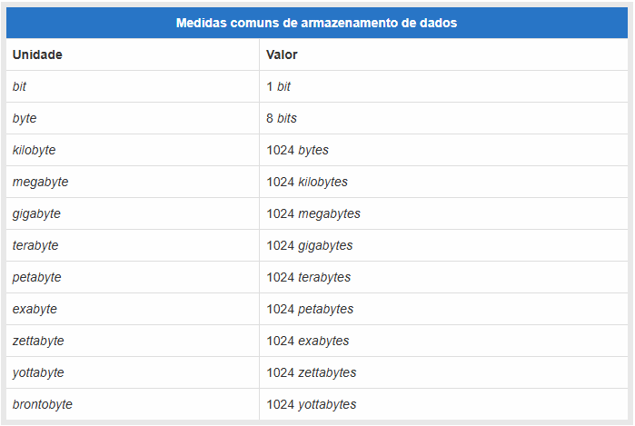
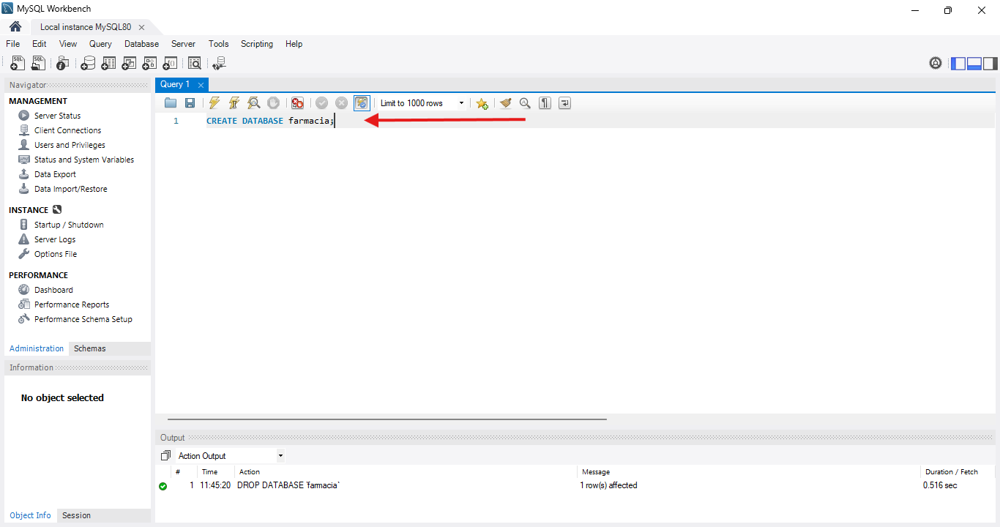
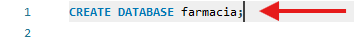
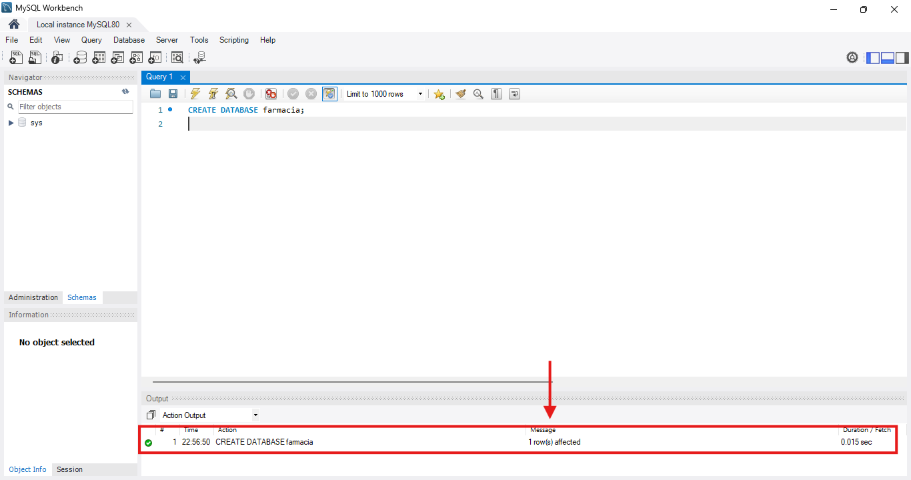
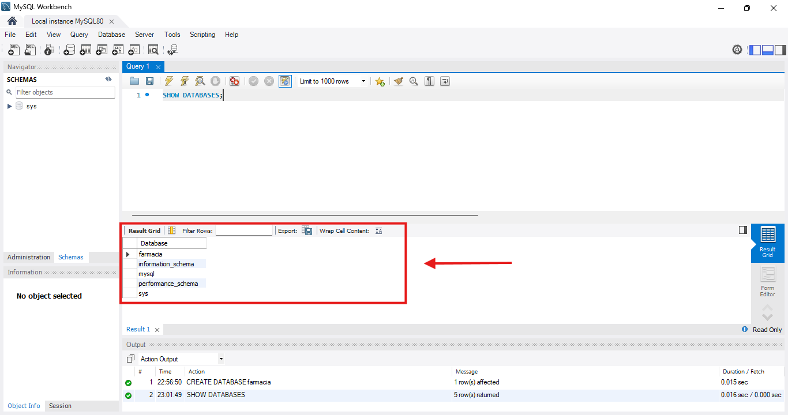
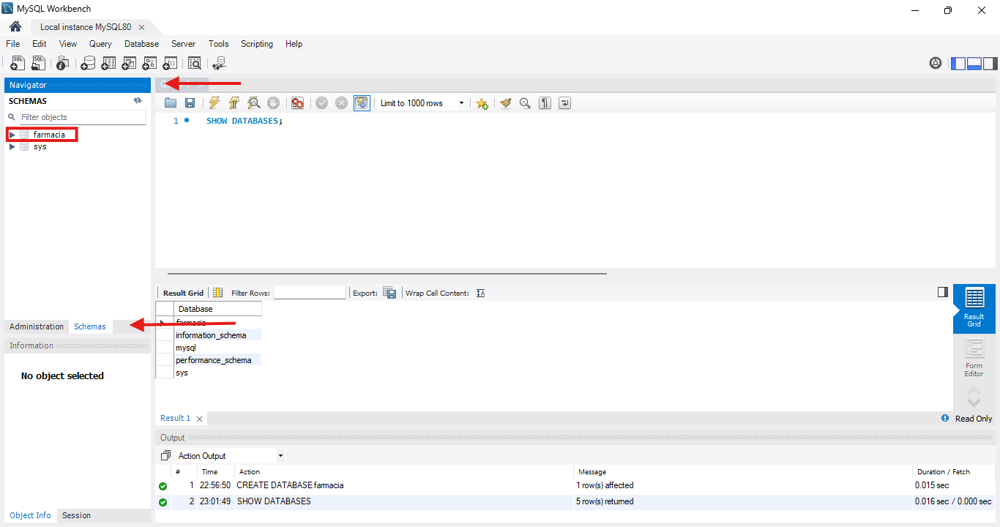

# Diário de Estudos — UC03

## 📅 06 de junho de 2025

### Tópico: Definições de Dados

## ℹ️ Informações

- **Início do estudo:** 06/06/2025  
- **Data de conclusão:** (preencher ao concluir o conteúdo)  
- **Última atualização:** 06/06/2025

## 📚 Conteúdo do Módulo

- [📌 Definição de dados](#-lição-1-definição-de-dados)
- [🧱 Criação de tabelas](#-lição-2-criação-de-tabelas)
- [🧾 Colunas (NULL, DEFAULT, AUTO_INCREMENT, PRIMARY KEY)](#-lição-3-colunas)
- [🧬 Tipos de dados (numéricos, lógicos, textuais, binários, data e hora)](#-lição-4-tipos-de-dados)
- [🔗 Chaves primárias e estrangeiras](#-lição-5-chaves-primárias-e-estrangeiras)
- [📎 Link para exemplo prático (em construção)](#-exemplo-prático)

---

## 📘 Lição 1: Definição de Dados

-
-

**🧠 Aprendizado:**  
Na computação, **dados** são todas as informações que podem ser lidas, transferidas e processadas, como textos, imagens, vídeos etc.

Todos esses dados precisam ser armazenados, ou seja, guardados de alguma maneira para que depois possam ser acessados, certo?

Como você já deve saber, todo dado computacional é representado por "0" e "1" (bits).

Os bancos de dados surgiram para facilitar o acesso a esses dados de forma fácil, rápida e confiável.

Os bits possuem sua própria unidade de medida, veja:



Os dados armazenados com o nosso querido SQL são organizados em tabelas (como no Excel) e podem assumir diferentes tipos: texto, números, datas, valores booleanos etc.

---

## 📅 07 de junho de 2025

## 📘 Lição 2: Criação de Tabelas

- Colunas
- NULL, DEFAULT, AUTO_INCREMENT, PRIMARY KEY

**🧠 Aprendizado:**

Devido à sua versatilidade, custo e velocidade, os bancos de dados são amplamente usados para armazenar informações.

Imagine, por exemplo, um banco como o Banco do Brasil. O banco armazena dinheiro e o administra, correto? Com o banco de dados é o mesmo.

Vamos ver agora como CRIAR essas famosas tabelas em que serão armazenados nossos preciosos dados.

Para isso, vamos utilizar a ferramenta **MySQL Workbench**.

Para aprender a instalá-lo, veja o conteúdo em: (link para conteúdo - Em desenvolvimento)


---

## Criação

**🧠 Aprendizado:**

Para criar uma nova base de dados, primeiramente abra o MySQL Workbench e conecte à instância local na tela inicial.

Dê um duplo clique na área marcada na imagem:


Neste momento, você se conectou ao servidor local, mas não há nenhum banco de dados criado ainda. Vamos fazer isso agora.

Para criar um banco de dados, utilize o comando:

```sql
CREATE DATABASE <nome do banco de dados>;
```

No curso, utilizamos o exemplo de um banco de dados para uma farmácia. Assim, o comando ficaria:

```sql
CREATE DATABASE farmacia;
```
Veja a imagem:



Para executar o comando e criar seu primeiro banco de dados, basta clicar em .

A opção  executarar apenas a linha de código/*script* (já se acostume com este termo) em que o curso estiver.

Exemplo:


Após executar esse comando, você verá, na aba **Output**, localizada na parte inferior da janela, a saída da execução. Essa saída mostrará a hora em que o comando foi executado, a ação realizada, quantas linhas foram afetadas (algo que você aprenderá em breve) e o tempo que a execução levou.



Meus parabéns! Você acabou de criar sua primeira base de dados chamada “farmácia”.
Agora, para listar as bases de dados existentes no servidor, você pode utilizar o seguinte comando:

```sql
SHOW DATABASES;
```

Então será motrado o resultado como na imagem:



Você tambem poderá visualizar todos os bancos de dados presentes no seu atual servidor MySQL, acessando aaba **SCHEMAS**, na seção **Vavigator**:



Conforme a imagem, deverá aparecer um banco de dados chamado **sys**, que é criado automacimamente pelo SGBD(sistema gerenciador de banco de dados) e sua tabela **farmacia**.

Se não aparecer, basta atualizar.

## Criação de tabelas

Depois de criado o banco de dados chamado **farmacia**, vamos criar as tabelas que irão conter os dados dos remédios.


**✅ NULL ou NOT NULL**
*Aqui*

**🧰 DEFAULT**
*Aqui*

**🔁 AUTO_INCREMENT**
*Aqui*

**🔐 PRIMARY KEY**  
*Aqui*

**➕➖ Adicionando e Removendo Colunas**  
*Aqui*

---

## 📘 Lição 4: Tipos de Dados

-
-

**🧠 Aprendizado:**

**🔢 Tipos Numéricos**  
*Aqui*

**⚙️ Tipos Lógicos**
*Aqui*

**📝 Tipos Textuais**
*Aqui*

💾 Tipos para Dados Binários  
*Aqui*

**⏱️ Tipos para Data e Hora**
*Aqui*

---

## 📘 Lição 5: Chaves Primárias e Estrangeiras

**🔑 Definindo Chave Primária**
*Aqui*

**🔗 Definindo Chave Estrangeira**
*Aqui*

**🔁 Relacionamento 1:1**  
*Aqui*

**🔄 Relacionamento 1:N**
*Aqui*

**🔃 Relacionamento N:N** 
*Aqui*

---

## 🧪 Exemplo Prático

📂 *Será incluído futuramente na pasta* `exercicios/`
