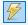

# Diário de Estudos — UC03

## 📅 [Data que iniciar o módulo]

### Tópico: Definições de Dados

## ℹ️ Informações

- **Início do estudo:** 06/06/2025  
- **Data de conclusão:** (preencher ao concluir o conteúdo)  
- **Última atualização:** 06/06/2025

## 📚 Conteúdo do Módulo

- [📌 Definição de dados](#-lição-1-definição-de-dados)
- [🧱 Criação de tabelas](#-lição-2-criação-de-tabelas)
- [🧾 Colunas (NULL, DEFAULT, AUTO_INCREMENT, PRIMARY KEY)](#-lição-3-colunas)
- [🧬 Tipos de dados (numéricos, lógicos, textuais, binários, data e hora)](#-lição-4-tipos-de-dados)
- [🔗 Chaves primárias e estrangeiras](#-lição-5-chaves-primárias-e-estrangeiras)
- [📎 Link para exemplo prático (em construção)](#-exemplo-prático)

---

## 📘 Lição 1: Definição de Dados

-
-

**🧠 Aprendizado:**  
Na computação, **dados** são todas as informações que podem ser lidas, transferidas e processadas, como textos, imagens, vídeos e etc.

Todos esse dados precisam ser armazenados, ou seja, guardados de alguma maneira para que depois possam ser acessados, certo?

Como você já deve saber, todo dado computacional é representado por "0" e "1" (bits).

Os bancos de dados surgiram para facilitar o acesso a esses dados de forma fácil, rápida e confiável.

Os bits possuem sua própria unidade de medida, veja:

(Imagem do curso)

Os dados armazenados com o nosso querido SQL, são armazenados em tabelas(como se fosse um excel), e são de tipos variados como texto, números, datas, valores booleanos e etc.

---

## 📘 Lição 2: Criação de Tabelas

- Colunas
- NULL, DEFAULT, AUTO_INCREMENT, PRIMARY KEY

**🧠 Aprendizado:**  
Lição 2: Criação de tabelas

Devido a seu sua versabilidade, custo e velocidade, os bancos de dados são amplamente usados para armazenar informações.

Imagine por exemplo um Banco, como o Banco do brasil. O baco armazena dinheiro e o administra, correto? Com o banco de ddos é o mesmo.


Vamos ver agora como CRIAR essas famosas tabelas em que serão armazenados nossos preciosos dados.

Para isso, vamos utilizar a ferramenta **MySQL Workbench**

Para aprender a instala-lo veja o conteúdo em:
link para conteúdo.
[Bits](./Imagens/bits.png)

---

## 📘 Lição 3: Colunas

**🧠 Aprendizado:**

Devido a seu sua versabilidade, custo e velocidade, os bancos de dados são amplamente usados para armazenar informações.

Vamos ver agora como CRIAR essas famosas tabelas em que serão armazenados nossos preciosos dados.

Para isso, vamos utilizar a ferramenta **MySQL Workbench**

Para aprender a instala-lo veja o conteúdo em:
(link para o conteúdo - em desenvolvimento)

**⚙️ Criação**

Para criar uma nova base de dados, primeiramente abra o **MySQL Workbench** e conecte à instância local na tela inicial.

Só dá um duplo click na area marcada na imagem:

[Ferramenta](./Imagens/MySQL%20Workbench.png)

Neste momento, voce se conectou ao servidor local, mas não há nenhum banco de dados criado ainda. Vamos fazer isso agora.

Para criar um banco de dados você deve utilizar o comando:

```sql
CREATE DATABASE <nome do banco de dados>;
```

No curso, utilizamos o exemplo de uma banco de dados para uma farmácia, então ficaria assim:

```sql
CREATE DATABASE farmacia;
```
Veja a imagem:

[CREATE DATABASE](./Imagens/CREATE.png)

Para executar o comando e criar seu primeiro banco de dados, basta clicar em .

A opção  executarar apenas a linha de código/*script* (já se acostume com este termo) em que o curso estiver.

Exemplo:
[](./Imagens/linha.png)


**✅ NULL ou NOT NULL**
*Aqui*

**🧰 DEFAULT**
*Aqui*

**🔁 AUTO_INCREMENT**
*Aqui*

**🔐 PRIMARY KEY**  
*Aqui*

**➕➖ Adicionando e Removendo Colunas**  
*Aqui*

---

## 📘 Lição 4: Tipos de Dados

-
-

**🧠 Aprendizado:**

**🔢 Tipos Numéricos**  
*Aqui*

**⚙️ Tipos Lógicos**
*Aqui*

**📝 Tipos Textuais**
*Aqui*

💾 Tipos para Dados Binários  
*Aqui*

**⏱️ Tipos para Data e Hora**
*Aqui*

---

## 📘 Lição 5: Chaves Primárias e Estrangeiras

**🔑 Definindo Chave Primária**
*Aqui*

**🔗 Definindo Chave Estrangeira**
*Aqui*

**🔁 Relacionamento 1:1**  
*Aqui*

**🔄 Relacionamento 1:N**
*Aqui*

**🔃 Relacionamento N:N** 
*Aqui*

---

## 🧪 Exemplo Prático

📂 *Será incluído futuramente na pasta* `exercicios/`
