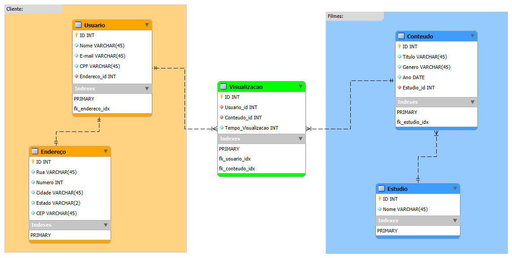
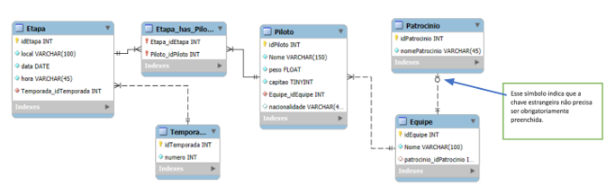

### 📄 Entidades Modeladas
- **Usuário** (com vínculo obrigatório a um endereço)
- **Endereço**
- **Conteúdo** (associado a um estúdio)
- **Estúdio**
- **Visualização** (relacionamento N:N entre usuário e conteúdo)

### 📌 Regras aplicadas
- Relacionamento 1:1 entre usuário e endereço  
- Relacionamento 1:N entre estúdio e conteúdo  
- Relacionamento N:N entre usuário e conteúdo (com atributos adicionais)


## 📅 Data do Registro: 18/06/2025

### ✅ Atividades — UC03 Auxiliar na modelagem e Manipulação de Dados

## ℹ️ Informações
- **Data de conclusão:** ***
- **Última atualização:** ***

## 📚 Índice de Atividades
- [Atividade 1](#-atividade-1---diagrama-er-para-sistema-de-streaming)
- [Atividade 2](#-atividade-2---sistema-para-associação-de-kart)
- [Atividade 3](#-atividade-3)

---

### 📝 Atividade 1 - Diagrama ER para Sistema de Streaming

**Descrição:**  
Nesta atividade, desenvolvi um Diagrama Entidade-Relacionamento (DER) no MySQL Workbench para representar as principais entidades e relações de um sistema de streaming de filmes.
O diagrama possui:

Entidades Modeladas
- *Usuário* (com vínculo obrigatório a um endereço)
- *Endereço*
- *Conteúdo* (associado a um estúdio)
- *Estúdio*
- *Visualização* (relacionamento N:N entre usuário e conteúdo)

Regras aplicadas
- Relacionamento 1:1 entre usuário e endereço  
- Relacionamento 1:N entre estúdio e conteúdo  
- Relacionamento N:N entre usuário e conteúdo (com atributos adicionais)

**Resposta:**  



## 🖥️ Avaliação do Tutor

Resultado: **A**
---

### 📝 Atividade 2 - Sistema para Associação de Kart

**Descrição:**  
Sua empresa foi contratada para desenvolver o sistema de uma associação nacional de kart. A equipe de análise já elaborou o diagrama ER e forneceu um documento PDF com o guia da temporada. A partir desses materiais, você deverá:

1. Criar o **script de criação do banco de dados** com base no diagrama ER.
2. Criar um **script de inserção de dados** utilizando as informações contidas no guia da temporada.
3. Atualizar os registros da tabela `Etapa`:
   - Substituir **Campo Grande** por **Salvador**
   - Substituir **Londrina** por **Goiânia**
4. Remover o patrocinador da equipe **Corredores de Aço**, devido a uma rescisão contratual por questões éticas:
   - **Importante:** Execute `SET SQL_SAFE_UPDATES = 0;` para desativar a proteção contra atualizações inseguras.
5. Exibir os **dados dos pilotos**.

Diagrama:



**Resposta:**  

```sql
-- UC03 - Atividade 02
-- Aluno: Luis Fernando S. Gomes
-- Data: 18/06/2025


-- SCRIPT DE CRIAÇÃO DO BANCO DE DADOS CONFORME DIAGRAMA ER:
CREATE DATABASE KART_AT02;
USE KART_AT02;

-- TEMPORADA
CREATE TABLE Temporada (
	idTemporada INT NOT NULL AUTO_INCREMENT,
    Numero INT NOT NULL,
    PRIMARY KEY(idTemporada)
);

-- PATROCINIO
CREATE TABLE Patrocinio (
	idPatrocinio INT AUTO_INCREMENT,
    nomePatrocinio VARCHAR(45) NOT NULL,
    PRIMARY KEY(idPatrocinio)
);

-- EQUIPE
CREATE TABLE Equipe (
	idEquipe INT NOT NULL AUTO_INCREMENT,
    Nome VARCHAR(45) NOT NULL,
    patrocinio_idPatrocinio INT UNIQUE,
    PRIMARY KEY(idEquipe),
    FOREIGN KEY(patrocinio_idPatrocinio) REFERENCES Patrocinio(idPatrocinio)
);

-- PILOTO
CREATE TABLE Piloto (
	idPiloto INT NOT NULL AUTO_INCREMENT,
    Nome VARCHAR(45) NOT NULL,
    Peso FLOAT NOT NULL,
    Capitao TINYINT NOT NULL,
    Equipe_idEquipe INT NOT NULL,
    Nacionalidade VARCHAR(45),
    PRIMARY KEY(idPiloto),
    FOREIGN KEY(Equipe_idEquipe) REFERENCES Equipe(idEquipe)
);

-- ETAPA
CREATE TABLE Etapa (
	idEtapa INT NOT NULL AUTO_INCREMENT,
    Local VARCHAR(45) NOT NULL,
    Data DATE NOT NULL,
    Hora VARCHAR(45)NOT NULL,
    Temporada_idTemporada INT NOT NULL,
    PRIMARY KEY(idEtapa),
    FOREIGN KEY(Temporada_idTemporada) REFERENCES Temporada(idTemporada)
);

-- Relacionamento N:N entre ETAPA e PILOTO
CREATE TABLE Etapa_has_Piloto (
	Etapa_idEtapa INT NOT NULL,
    Piloto_idPiloto INT NOT NULL,
    FOREIGN KEY(Etapa_idEtapa) REFERENCES Etapa(idEtapa),
    FOREIGN KEY(Piloto_idPiloto) REFERENCES Piloto(idPiloto)
);


-- SCRIPT DE INSERÇÃO DE DADOS DE ACORDO COM INFORMAÇÕES APARTIR DO PDF

-- TEMPORADA
INSERT INTO Temporada (Numero)
	VALUES (1);

-- PATROCINIO
INSERT INTO Patrocinio (nomePatrocinio)
	VALUES
	('MotorTech Brasil'),
	('Velocidade Extrema'),
	('Alta Performance'),
	('Turbo Racing'),
	('Pneus ProDrive');

-- EQUIPE
INSERT INTO Equipe (Nome, patrocinio_idPatrocinio)
	VALUES
	('Escuderia Veloz', 1),
	('Rápidos & Furiosos', 2),
	('Fênix Racing', 3),
	('Equipe Tempestade', 4),
	('Corredores de Aço', 5);

-- PILOTO
INSERT INTO Piloto (Nome, Peso, Capitao, Equipe_idEquipe, Nacionalidade)
VALUES
	('Lucas Andrade', 70.5, 1, 1, 'Brasil'),
	('Renato Figueiredo', 75.0, 0, 1, 'Brasil'),
	('Mateus Silva', 68.0, 0, 2, 'Brasil'),
	('Bruno Almeida', 78.3, 1, 2, 'Brasil'),
	('Carla Pereira', 60.0, 1, 3, 'Portugal'),
	('Gabriela Torres', 58.5, 0, 3, 'Brasil'),
	('João Costa', 80.5, 0, 4, 'Brasil'),
	('Thiago Santos', 72.5, 0, 4, 'Brasil'),
	('Mariana Gomes', 62.0, 1, 5, 'Portugal'),
	('Beatriz Lopes', 63.2, 1, 5, 'Portugal');

-- ETAPA
INSERT INTO Etapa (Local, Data, Hora, Temporada_idTemporada)
VALUES
	('São Paulo', '2024-01-15', '14:00', 1),
	('Rio de Janeiro', '2024-02-20', '16:00', 1),
	('Campo Grande', '2024-03-18', '15:00', 1),
	('Londrina', '2024-04-22', '13:00', 1),
	('Porto Alegre', '2024-05-10', '10:00', 1);


-- ALTERAR ETAPAS DE CAMPO GRANDE E LONDRINA PARA SALVADOR E GOIÂNIA
UPDATE Etapa SET Local = 'Salvador' WHERE Local = 'Campo Grande';
UPDATE Etapa SET Local = 'Goiânia' WHERE Local = 'Londrina';

-- É NECESSÁRIO EXCLUIR OS DADOS DO PATROCINADOR DA EQUIPE CORREDORES DE AÇO.
-- OBS: Desative o modo segurança para essa sessão:
SET SQL_SAFE_UPDATES = 0;
UPDATE Equipe SET patrocinio_idPatrocinio = NULL WHERE Nome = 'Corredores de Aço';

-- POR FIM, EXIBA OS DADOS DOS PILOTOS.
SELECT * FROM Piloto;

-- Entregue o arquivo da atividade em fromato compactado (rar, zip ou 7z) com o scripts
```

## 🖥️ Avaliação do Tutor

Resultado: ****

---

### 📝 Atividade 3

**Descrição:**  


**Resposta:**  


---
